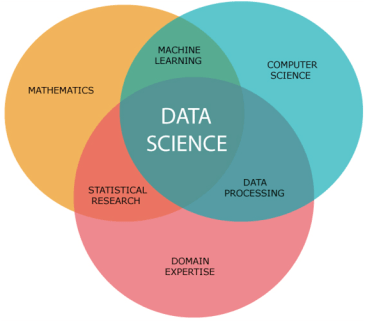

# Introduction to Data Science

[https://medium.com/analytics-vidhya/introduction-to-data-science-28deb32878e7](https://medium.com/analytics-vidhya/introduction-to-data-science-28deb32878e7)

## Probability and Statistics

Bayes Theorem

Cdf - Pdfs

Mean
Meadian
Geometric Mean
Standard Deviation

[Why do we divide by n-1 and not n? | shown with a simple example | variance and sd](https://youtu.be/pLH1QA4F9uE?feature=shared)